# 1. Problem and Data

The task is **human activity recognition (HAR)**: each example is a 5-minute window of
wrist-worn 3-axis accelerometer readings, stored as one CSV file of **300 rows**
(one row per second) with six aggregated channels — `mean_x`, `mean_y`, `mean_z`,
`std_x`, `std_y`, `std_z`. Every file carries a single activity label in
`{0,1,2,3,4,5}`, and the goal is to predict that one label per test file. The
official metric is **macro-averaged F1**, which weights all six classes equally and
therefore makes the rare classes decisive.

The data is grouped by user: **60 users for training** (`User_001`–`User_060`,
11,020 windows) and **40 disjoint users for testing** (`User_061`–`User_100`,
6,849 windows). Because train and test users never overlap, the model must
generalise *across people*, not merely across windows — the single most important
fact driving our design.

The grading baselines are Baseline-1 = 0.1201, Baseline-2 = 0.6130, and
Baseline-3 = 0.7088. Our final submission (macro-F1 **0.8270**) is well above all
three and currently **ranks 1st** on the public leaderboard.

# 2. Q1 — Preliminary Analysis

**Class imbalance is severe and is the core difficulty.** Classes 0 and 1 together
account for ~85% of windows, while classes 2, 4 and 5 are rare (3.25%, 1.29%, 4.77%).
Under macro-F1, the rare classes — especially class 2 — dominate the achievable score.

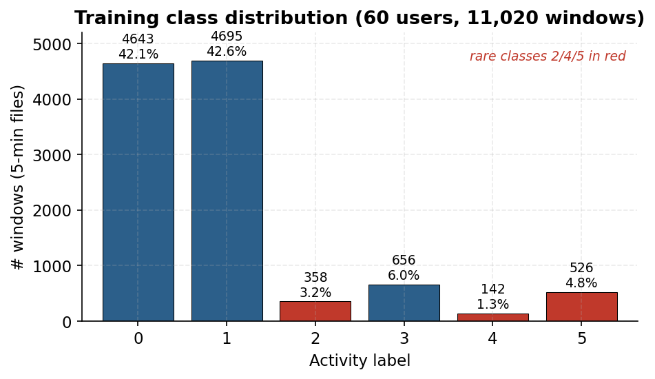{width=72%}

**Naive baselines quantify the floor.** Predicting the majority class (label 1) for
every file gives macro-F1 = **0.0996**; predicting each class in proportion to its
prior gives ~**0.167**. These match the order of the official Baseline-1 (0.1201).
A plain histogram-gradient-boosting (HGB) model on engineered features already
reaches **0.7292** (5-fold grouped CV) — above Baseline-3 — confirming that the
signal is strongly learnable but that the headroom is entirely in the rare classes.

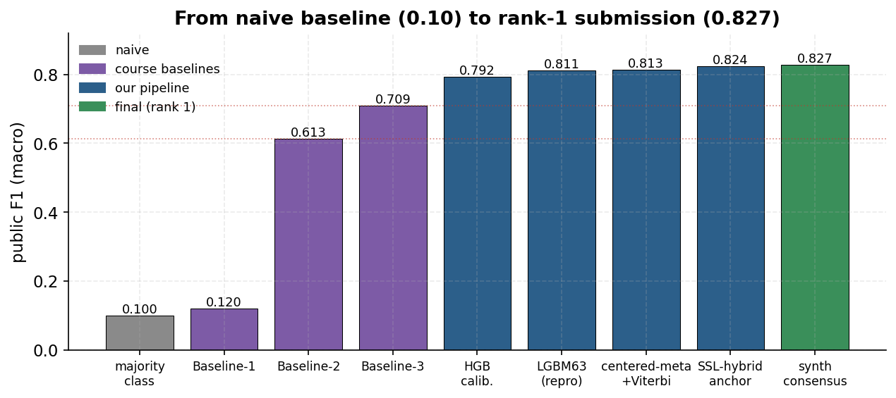{width=92%}

**Three observations that shaped the method.**

1. *Grouped generalisation.* Because test users are disjoint, all validation uses
   **StratifiedGroupKFold grouped by `user_id`** (seed 2026). Random k-fold would
   leak per-user style and badly overstate the score.
2. *Gravity is in the signal.* The accelerometer keeps the gravity component; the
   mean-vector magnitude `mean_vm` has median $\approx$ 0.997 g, so orientation (how the
   wrist is held) is highly informative — later confirmed by ablation.
3. *Predicted test distribution stays realistic.* Our final submission predicts a
   class mix close to the training prior (e.g. class 2 $\approx$ 2.7% vs 3.25% train),
   which is exactly what a non-overfit model should do; submissions that inflated
   class 2 to >10% regressed on the public board.

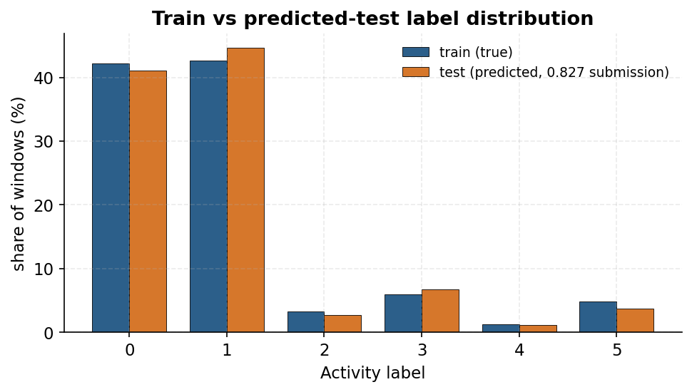{width=72%}

# 3. Q2 — Preprocessing and Feature Engineering

Each $300\times6$ window is summarised into a single fixed-length feature vector
(**399 base features**, plus 6 user-sequence *position* features = **405** for the
final tree model). Features are grouped into seven families:

| Family | What it captures | # feat. removed |
|---|---|---:|
| Global channel statistics | quantiles, RMS, range, skew, kurtosis (6 channels) | base |
| Gravity / magnitude | mean-vm, std-vm, deviation-from-1g, energy ratio | 124 |
| Temporal derivatives | second-to-second volatility, energy, abs-change, zero-cross | 48 |
| Segment / rolling | five 1-min segment summaries; 5/15/30-s rolling stats | 130 |
| Frequency (FFT @1 Hz) | band power, dominant frequency, spectral entropy, centroid | 40 |
| Cross-axis / orientation | orientation summaries, axis correlations, covariance | 48 |
| User-sequence position | normalised order, edge distance, sin/cos phase, length | +6 |

**Each preprocessing choice is measured.** The table and figure below give the
5-fold grouped-CV macro-F1 change from removing each family (HGB backbone).

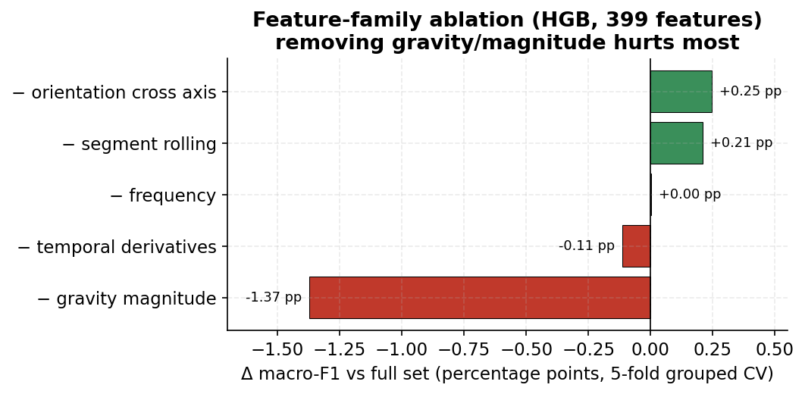{width=80%}

- **Gravity / magnitude** is the only clearly load-bearing family: removing its 124
  features drops macro-F1 by **−0.0137** (0.7292 $\rightarrow$ 0.7155). This validates the
  Q1 observation that wrist orientation carries activity information.
- Temporal derivatives are mildly positive (−0.0011 when removed). Segment, frequency
  and orientation families are individually near-neutral for the *tree* model but
  matter for the *sequence* and *ensemble* members (Q3/Q4); we keep them because the
  downstream models exploit them.

**Class-bias calibration is the single most effective preprocessing step for
macro-F1.** Tree probabilities are post-processed by per-class multiplicative
weights fitted on out-of-fold (OOF) predictions to maximise macro-F1, then
re-normalised. For the final LightGBM-leaves63 model this lifts OOF macro-F1 from
**0.7251 $\rightarrow$ 0.7477 (+0.0226)**. The fitted weights up-weight the rare, hard class 2
by a factor of **5.86** while slightly down-weighting the easy majority classes.

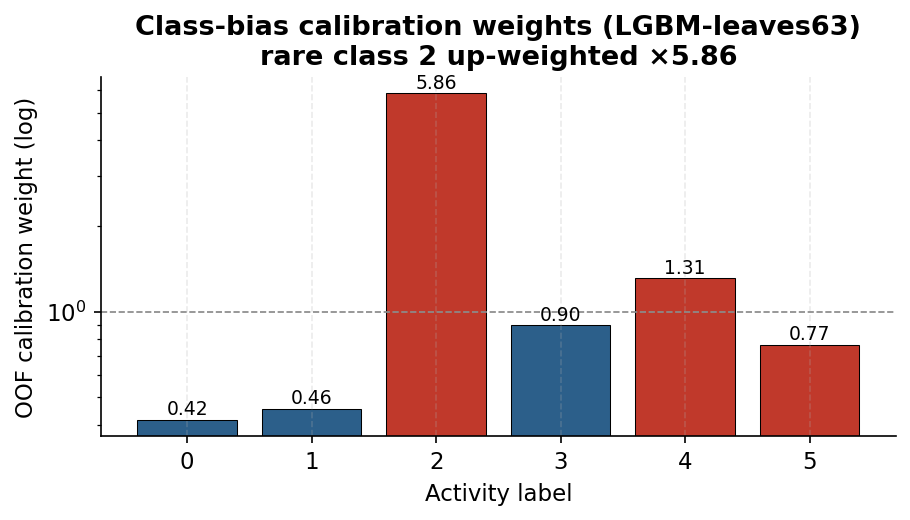{width=66%}

The confusion matrix of the calibrated tree model shows where the remaining error
lives: class 2 is confused mainly with classes 1 and 3, and class 5 with class 1 —
both are *temporally adjacent* activities, which motivates the sequence modelling in Q3.

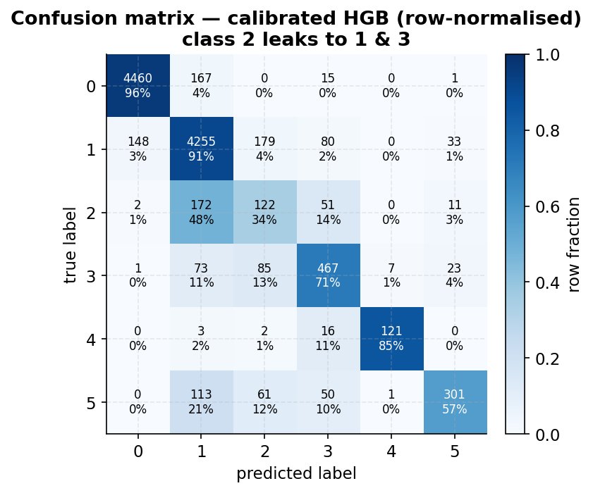{width=62%}

# 4. Q3 — Aligning Labels with the Sequential Readings

**Label–reading alignment.** The raw signal is a sequence (300 seconds $\times$ 6 channels)
but the label is defined at the *file* level. We align them at two granularities:

1. *Within a file (intra-window):* the 300-step sequence is reduced to one vector via
   the statistical / temporal / spectral features of Q2 (so the per-second ordering is
   summarised by derivatives, segment trends, and FFT), and additionally fed **raw**
   to sequence models (InceptionTime, ROCKET/MiniRocket) that learn temporal filters
   directly. All training and prediction join on `file_id`, so labels and features are
   always aligned by file.
2. *Across a user's files (inter-window):* each user's files form a chronological
   chain, and **activities persist** — neighbouring 5-minute windows usually share a
   label. We exploit this with **Viterbi temporal smoothing**.

**Temporal features added.** Beyond the static statistics we add: first-difference
("velocity") features for second-to-second motion, $5\times1$-minute **segment** summaries
that expose within-window trends, 5/15/30-s **rolling** statistics, and a 1-Hz
**FFT** band decomposition. The 6 user-sequence **position** features encode where a
file sits in its user's chain (normalised index, edges, phase).

**Sequence models.** On the raw $6\times300$ windows we train (a) **ROCKET / MiniRocket**
random-convolution transforms feeding linear/tree heads, and (b) **InceptionTime**
CNNs pre-trained self-supervised (SimCLR/BYOL) on all 17,869 train+test sequences
then fine-tuned. These complement the tree features: MiniRocket+blend reaches OOF
0.760 (public 0.809) and the SSL-InceptionTime blend reaches public 0.8175.

**Viterbi smoothing — how it captures temporal dependency.** We treat each user's
file sequence as a hidden Markov chain. A label$\rightarrow$label **transition matrix** is
estimated *from training folds only* (Laplace-smoothed, fold-fair to avoid leakage),
and a per-user Viterbi decode combines each file's model log-probability (emission)
with the transition prior, scaled by a temporal weight $\beta$ (with class weights $\alpha$ tuned
per fold via grid search). A confident but temporally implausible single-file
prediction can thus be overruled by its neighbours. The effect is consistently
positive across every model family:

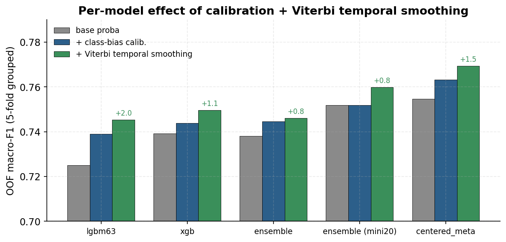{width=86%}

Viterbi adds **+0.006 to +0.026** macro-F1 depending on the base model (e.g. the
centered-meta blend 0.7631 $\rightarrow$ **0.7693**). Per-class, the gain concentrates on the
*sequential* classes 3 and 5, exactly the transitions the chain prior can fix:

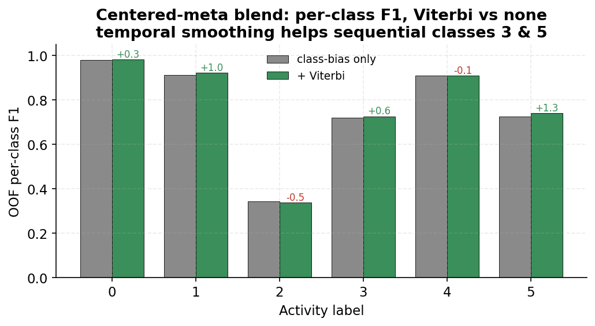{width=72%}

# 5. Q4 — Core Model Design and Ablation Study

## 5.1 Design progression

We built the final model bottom-up, validating each addition by grouped CV **and**
public score. The table is the core ablation; the figure shows the public-score
progression.

| Design choice | OOF / HOS macro-F1 | Public F1 | Verdict |
|---|---:|---:|---|
| HGB (399 feat) | 0.7292 | 0.7922 | baseline |
| + class-bias calibration | 0.7382 | — | kept (+0.009 OOF) |
| **LightGBM-leaves63 + position (reproducible final)** | **0.7477** | **0.8106** | **safety baseline** |
| 2- / 5-model tree blends | 0.752–0.753 | 0.798–0.801 | rejected (prior shift) |
| MiniRocket / ROCKET blends | 0.760–0.761 | 0.806–0.809 | source added |
| **Centered-meta blend + Viterbi** | **0.7693** | **0.8130** | backbone |
| + InceptionTime-SSL (blend+Viterbi) | 0.7871 | 0.8175 | source added |
| 4-source weighted ensemble | 0.7830 (LNUO 0.7752) | $\rightarrow$ anchors | core ensemble |
| SSL-hybrid / refine anchors | — | 0.8240–0.8248 | anchors |
| **Consensus "synth" aggregation** | HOS-12 0.8006 | **0.8270** | **final, rank 1** |

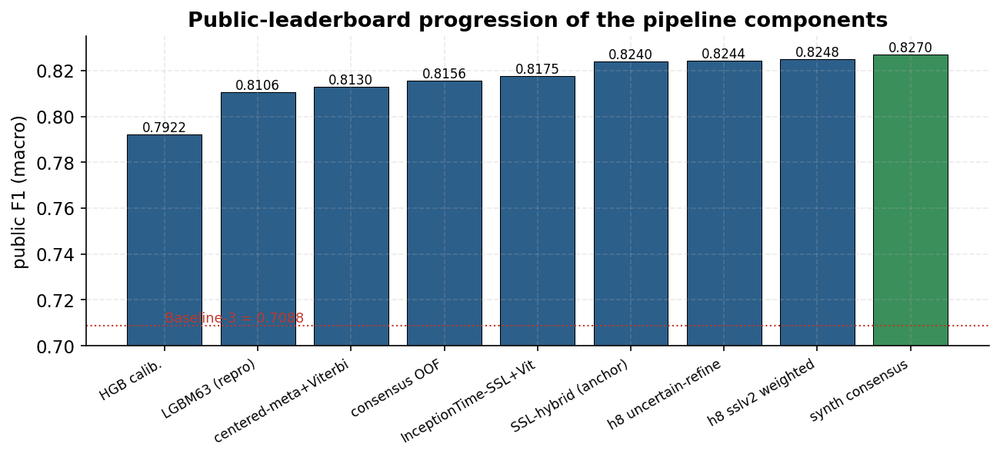{width=92%}

## 5.2 The core technical choice: validate on held-out *users*, not OOF

The decisive design decision was **not** a model — it was the validation protocol.
Early on, ensembles with the best OOF scores *regressed* on the public board:
`ensemble_v2` had OOF 0.8118 but public 0.7963, and a 5-source ensemble with OOF
0.787 scored only 0.8123. OOF on the 60 training users decouples from the public
score on unseen users.

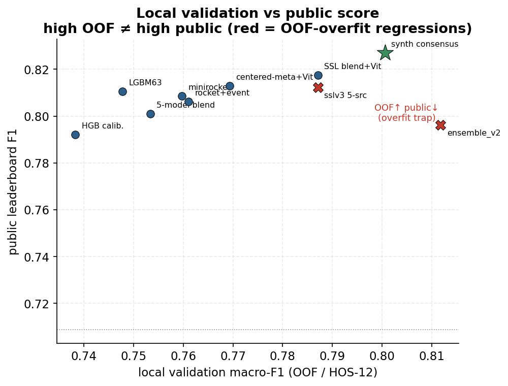{width=72%}

We therefore adopted a **fresh 12-user hold-out (HOS-12, seed 2027)** — a slice of
users never used for any tuning — as the gate for every late-stage change. Only edits
that improved HOS-12 *and* passed a multi-view robustness check were accepted.

## 5.3 Final aggregation: audited consensus flips

The final submission is a **consensus aggregation** over the strongest sources. Three
"aggressive" candidates (5-source HOS-12-optimised blends) and three high-scoring
anchors (0.8248 / 0.8244 / 0.8240) vote per test file. Starting from the best single
anchor (0.8248), we **flip a file's label only when** (i) the top anchors disagree
(a genuinely uncertain "mixed zone"), (ii) all three aggressive candidates agree on
the same non-anchor label, and (iii) that label is supported by a second anchor. This
yields just **28 changed files** out of 6,849 — a deliberately conservative,
fully-audited edit set — lifting the anchor from 0.8248 to **0.8270**.

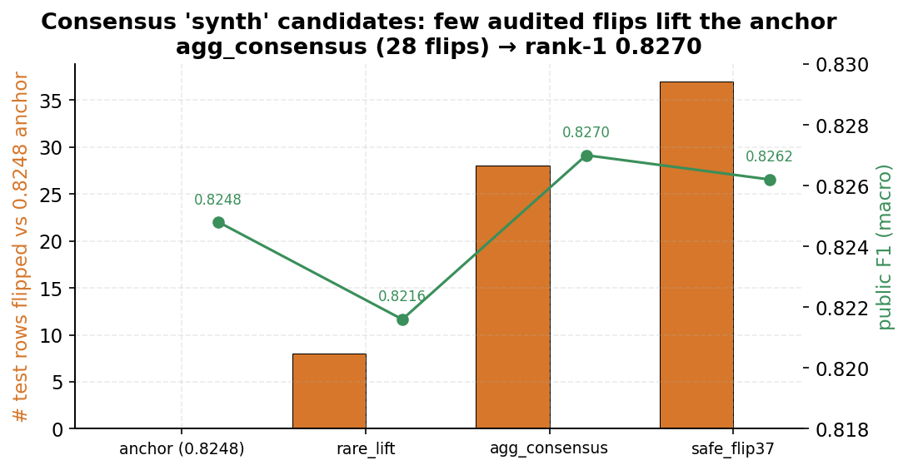{width=76%}

The conservatism is the point: more aggressive flip sets (37 flips) reached the same
HOS-12 estimate but slightly lower public score, and rare-class-only lifts (8 flips)
regressed. The 28-flip consensus is the most defensive candidate that still improves.

## 5.4 Running-best over the competition

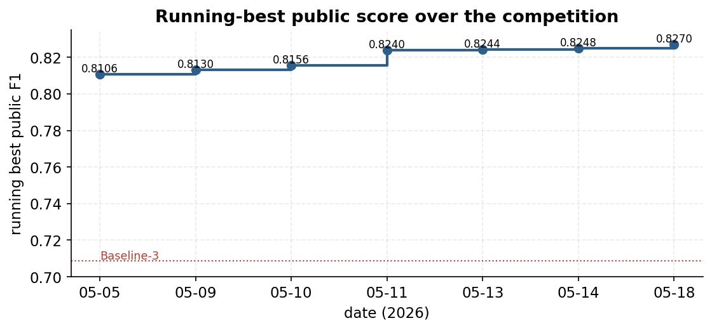{width=74%}

# 6. Final Submission and Results

- **Selected submissions:** `synth_agg_consensus.csv` (public **0.8270**, rank 1) and
  `synth_safe_flip37.csv` (0.8262), with the fully-reproducible LightGBM-leaves63
  submission (0.8106) retained as a robustness anchor.
- **Why this should hold on the private board:** the design was optimised on held-out
  *users* (HOS-12), the predicted class priors track the training distribution, and
  the final edit set is tiny and audited — all chosen to avoid public-leaderboard
  overfitting, which the spec warns is punished on the harder private split.

# 7. How to Run the Code

Public repository: **https://github.com/RaisoLiu/DM2026-Assignment-3**

```bash
# 1. clone + environment
git clone https://github.com/RaisoLiu/DM2026-Assignment-3.git
cd DM2026-Assignment-3
python3 -m venv .venv && source .venv/bin/activate
pip install -r requirements.txt

# 2. data (provides data/raw/sample_submission.csv used for Id ordering)
kaggle competitions download -c nycu-data-mining-assignment-3 -p data/raw --force
unzip -q -o data/raw/nycu-data-mining-assignment-3.zip -d data/raw

# 3. reproduce the rank-1 submission (deterministic, CPU, seconds)
make final          # == python scripts/build_synth_candidates.py + sha256sum
# Expected:
# 54075fcb...  submissions/synth_agg_consensus.csv   (public 0.8270)
# 9921d49d...  submissions/synth_safe_flip37.csv      (public 0.8262)

# (optional) reproduce the simple LightGBM baseline (0.8106) from scratch:
python scripts/run_experiment.py --data-dir data/raw \
  --output-dir artifacts/hgb_fast_5fold --feature-cache-dir artifacts/features \
  --n-splits 5 --seed 2026 --fast --models hist_gradient_boosting
python scripts/explore_models.py --context position --models lgbm_leaves63 --seed 2026
python scripts/make_boosting_submission.py \
  --results-csv artifacts/model_search_position_proba/results_position.csv \
  --model lgbm_leaves63 --context position \
  --output submissions/submission_lgbm_leaves63_calibrated.csv --seed 2026

# (optional) full end-to-end regeneration incl. GPU SSL training (best effort):
FULL=1 ./run_full_pipeline.sh
```

# 8. Reproducibility and Consistency

The graded submission is **byte-for-byte reproducible**: a fresh clone plus
`make final` regenerates `synth_agg_consensus.csv` with SHA-256
`54075fcb…` (verified). The final aggregation
(`scripts/build_synth_candidates.py`) is pure, deterministic NumPy/pandas reading
committed input CSVs. The upstream representation-learning steps (SSL InceptionTime,
BYOL) run on a GPU and are not bit-reproducible across hardware; their trained
probability artifacts are therefore **committed as pinned inputs**, so the
deterministic final step always reproduces the submitted result, while
`run_full_pipeline.sh` (with `FULL=1`) documents and re-runs the entire chain for
audit. Full details and the dependency DAG are in `report/REPRODUCIBILITY.md`.
Random seed 2026 is fixed throughout; all validation uses StratifiedGroupKFold by
user.

# 9. Conclusion and Limitations

Starting from a 0.10 naive floor, a pipeline of (i) gravity-aware feature
engineering, (ii) macro-F1 class-bias calibration, (iii) per-user Viterbi temporal
smoothing, (iv) a self-supervised InceptionTime + tree/ROCKET ensemble, and (v) an
audited consensus aggregation reaches **macro-F1 0.8270 (public rank 1)**. The
dominant limitation is **class 2** (F1 $\approx$ 0.30–0.44): it is rare and temporally
confusable with classes 1 and 3, and remains the clearest target for further gains.
The largest methodological risk — public-leaderboard overfitting on the harder
private split — was mitigated by held-out-*user* validation (HOS-12) and a
deliberately small, audited final edit set.
